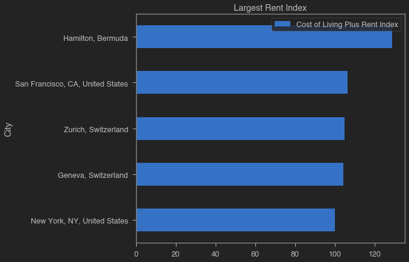
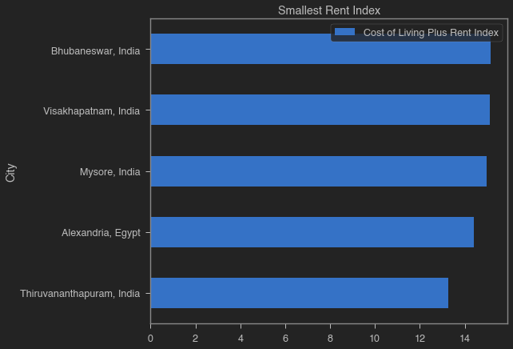

# Team13: Capstone project of Python Bootcamp

This is [the Capstone project for Team 13 of the Python Data Analysis Bootcamp](https://github.com/pyladiesams/Bootcamp-Data-Analysis-beginner-apr-may2020/blob/master/Capstone/README.md).
We are trying, more or less, to follow the structure of [jupytemplate](https://github.com/xtreamsrl/jupytemplate/blob/master/jupytemplate/jupytemplate/template.ipynb).

## Purpose

State the purpose of the notebook.

## Methology

Quickly describe assumptions and processing steps.

## TODO / Improvements

* [x] Find a dataset that has at least 2 CSV files
* [ ] Come up with 5 questions that you want to answer while exploring the dataset
* [ ] Perform EDA (Exploratoty Data Analysis) on your dataset with basic visualisations

## Results

## Setup


```python
# install system dependencies
import sys
import os

!conda install -c conda-forge --yes --prefix {sys.prefix} pandas jupyterthemes seaborn jupyter_contrib_nbextensions pandoc
```

    Collecting package metadata (current_repodata.json): done
    Solving environment: done
    
    # All requested packages already installed.
    


### Library Import


```python
# load libraries and setup environment
# mandatory
import pandas as pd

%matplotlib inline
import matplotlib.pyplot as plt

# optional
import numpy as np
import seaborn as sns
from jupyterthemes import jtplot
from IPython.core.display import HTML
jtplot.style(theme='monokai', context='notebook', ticks=True, grid=False)
```

## Parameter definition

We set all relevant parameters for our notebook. By convention, parameters are uppercase, while all the other variables follow Python's guidelines.

## Data import
We retrieve all the required data for the analysis.


```python
cost_of_living = pd.read_csv('../data/andytran11996_cost-of-living/datasets_73059_162758_cost-of-living-2018.csv')

# we are droppping the Rank column because it's entirely empty
cost_of_living = cost_of_living.drop(columns = 'Rank')
```

## Data processing

### 1. What are the five cities with the highest/lowest cost of living (incl. rent)?


```python
caption_column = 'City'
index_column = 'Cost of Living Plus Rent Index'

def display_cost_of_living(costs, title):
    filtered_costs = costs[[caption_column, index_column]].sort_values(index_column)
    filtered_costs.plot.barh(title = title, x = caption_column, y = index_column)
    plt.show()
    display(filtered_costs.style.hide_index())

# print the ten most expensive cities in the database in 2018
display_cost_of_living(cost_of_living.nlargest(5, index_column), 'Largest Rent Index')
display_cost_of_living(cost_of_living.nsmallest(5, index_column), 'Smallest Rent Index')
```





<style  type="text/css" >
</style><table id="T_e504f09e_a43c_11ea_9865_2df6e64f41b3" ><thead>    <tr>        <th class="col_heading level0 col0" >City</th>        <th class="col_heading level0 col1" >Cost of Living Plus Rent Index</th>    </tr></thead><tbody>
                <tr>
                                <td id="T_e504f09e_a43c_11ea_9865_2df6e64f41b3row0_col0" class="data row0 col0" >New York, NY, United States</td>
                        <td id="T_e504f09e_a43c_11ea_9865_2df6e64f41b3row0_col1" class="data row0 col1" >100.000000</td>
            </tr>
            <tr>
                                <td id="T_e504f09e_a43c_11ea_9865_2df6e64f41b3row1_col0" class="data row1 col0" >Geneva, Switzerland</td>
                        <td id="T_e504f09e_a43c_11ea_9865_2df6e64f41b3row1_col1" class="data row1 col1" >104.380000</td>
            </tr>
            <tr>
                                <td id="T_e504f09e_a43c_11ea_9865_2df6e64f41b3row2_col0" class="data row2 col0" >Zurich, Switzerland</td>
                        <td id="T_e504f09e_a43c_11ea_9865_2df6e64f41b3row2_col1" class="data row2 col1" >105.030000</td>
            </tr>
            <tr>
                                <td id="T_e504f09e_a43c_11ea_9865_2df6e64f41b3row3_col0" class="data row3 col0" >San Francisco, CA, United States</td>
                        <td id="T_e504f09e_a43c_11ea_9865_2df6e64f41b3row3_col1" class="data row3 col1" >106.290000</td>
            </tr>
            <tr>
                                <td id="T_e504f09e_a43c_11ea_9865_2df6e64f41b3row4_col0" class="data row4 col0" >Hamilton, Bermuda</td>
                        <td id="T_e504f09e_a43c_11ea_9865_2df6e64f41b3row4_col1" class="data row4 col1" >128.760000</td>
            </tr>
    </tbody></table>





<style  type="text/css" >
</style><table id="T_e504f09f_a43c_11ea_9865_2df6e64f41b3" ><thead>    <tr>        <th class="col_heading level0 col0" >City</th>        <th class="col_heading level0 col1" >Cost of Living Plus Rent Index</th>    </tr></thead><tbody>
                <tr>
                                <td id="T_e504f09f_a43c_11ea_9865_2df6e64f41b3row0_col0" class="data row0 col0" >Thiruvananthapuram, India</td>
                        <td id="T_e504f09f_a43c_11ea_9865_2df6e64f41b3row0_col1" class="data row0 col1" >13.260000</td>
            </tr>
            <tr>
                                <td id="T_e504f09f_a43c_11ea_9865_2df6e64f41b3row1_col0" class="data row1 col0" >Alexandria, Egypt</td>
                        <td id="T_e504f09f_a43c_11ea_9865_2df6e64f41b3row1_col1" class="data row1 col1" >14.400000</td>
            </tr>
            <tr>
                                <td id="T_e504f09f_a43c_11ea_9865_2df6e64f41b3row2_col0" class="data row2 col0" >Mysore, India</td>
                        <td id="T_e504f09f_a43c_11ea_9865_2df6e64f41b3row2_col1" class="data row2 col1" >14.980000</td>
            </tr>
            <tr>
                                <td id="T_e504f09f_a43c_11ea_9865_2df6e64f41b3row3_col0" class="data row3 col0" >Visakhapatnam, India</td>
                        <td id="T_e504f09f_a43c_11ea_9865_2df6e64f41b3row3_col1" class="data row3 col1" >15.110000</td>
            </tr>
            <tr>
                                <td id="T_e504f09f_a43c_11ea_9865_2df6e64f41b3row4_col0" class="data row4 col0" >Bhubaneswar, India</td>
                        <td id="T_e504f09f_a43c_11ea_9865_2df6e64f41b3row4_col1" class="data row4 col1" >15.140000</td>
            </tr>
    </tbody></table>


## References

* [data for the cost of living](https://www.kaggle.com/andytran11996/cost-of-living/)
* [base data for countries of the world](https://www.kaggle.com/fernandol/countries-of-the-world)
* [data for life expectancy from the WHO](https://www.kaggle.com/kumarajarshi/life-expectancy-who)
* [roshansharma_europe-datasets](https://www.kaggle.com/roshansharma/europe-datasets)
